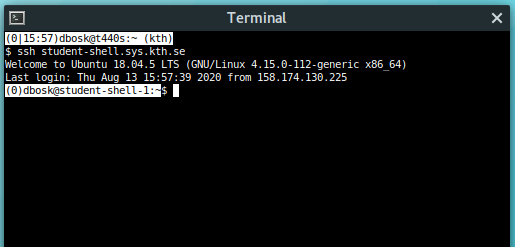

# Guide to accessing the terminal

You will need to use the terminal in many cases in the future, most imminently 
for the next coming assignments in this course. In this assignment you'll 
  ensure you have a terminal to use. 

There are several options for accessing a UNIX-like terminal. We'll cover (1) 
running it on your own system, (2) using a KTH system remotely.


## On your own system

If you run Linux or MacOS, you're already running a UNIX-like system. Then you 
can just start the terminal (just search for it).

On a Windows system it is a bit more complicated. While Windows also have a 
command-line interface, it's not compatible with a UNIX-like interface. If you 
run Windows 10, just go ahead and [install Windows Subsystem for Linux][WSL] 
(WSL) to run Ubuntu in Windows.

[WSL]: https://www.howtogeek.com/249966/how-to-install-and-use-the-linux-bash-shell-on-windows-10/

For older versions of Windows, you should [install CygWin][cygwin] or use KTH's 
systems remotely (see below).

[cygwin]: https://cygwin.com/install.html


## Use a KTH system remotely

Again, if you run a UNIX-like system, such as Linux, MacOS or WSL (as above); 
then you can use the `ssh` command in the terminal to access a KTH system 
remotely. Just run
```
ssh student-shell.sys.kth.se
```
and log in with your normal username and password.

If you run Windows without WSL, you'll need [PuTTY][putty] and 
[WinSCP][winscp]. PuTTY will open a terminal that's running on KTH's servers, 
just give `student-shell.sys.kth.se` as the hostname in PuTTY.

[putty]: https://www.chiark.greenend.org.uk/~sgtatham/putty/latest.html
[winscp]: https://winscp.net/eng/download.php

WinSCP is used for copying files between the your local system and the remote 
KTH system. This allows you to upload or download files from your KTH home 
directory. As with PuTTY, just give `student-shell.sys.kth.se` as the hostname.


## The end result

If you succeeded, you should have window that looks something like 
+@fig:terminal.

{#fig:terminal}

